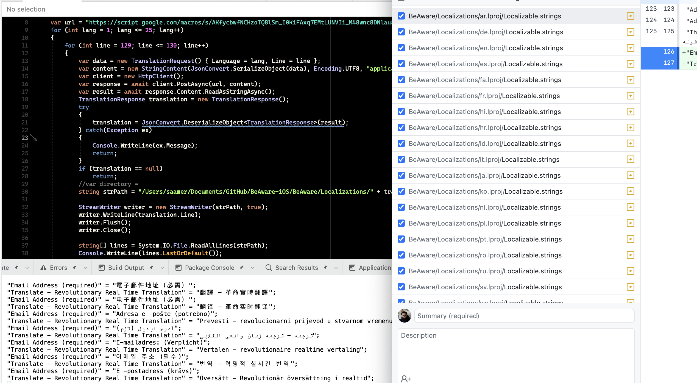
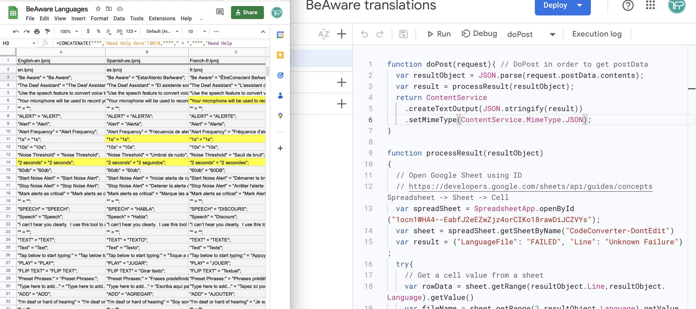

# DotNet GoogleSheet Swift LocalizationsAppender
 A DotNet console application that gets translations from GoogleSheet and adds it to a Swift Localizations file at the end (Append)

I have in the past talked about [how to localize your SwiftUI app](https://docs.google.com/presentation/d/1GXwYenBwiGCInzul9nBy3BHfl1177IGX9y6i9WD8fyI/edit)

Since I have a [free app for the Deaf and Hard of Hearing called BeAware](https://deafassistant.com/app) that is translated to 25 languages, there were still some manual steps involved, the code in this file automates those as well.

 app, I created a #JavaScript AppScript API, that pulls =GOOGLETRANSLATE translations from Google Sheets. Then a #Csharp console app gets values & writes to #Swift App Code localizations files!

## Steps to use this : 

1. Google Sheet with translations:

As you can see in the [translations Google Spreadsheet](https://docs.google.com/spreadsheets/d/1ocn1WHA4--EabfJ2eEZwZjz4orCIKo18rawDiJCZVYs/edit#gid=1560650986), I have the following sheets
- `RawData` is where I add more translations, and automate those using the =GOOGLETRANSLATE() function
- `Need Help Here` is where I paste the new rows as values above the `------ APP STORE` row 
- `CodeConverter` is where I just copy and paste the row above it, and it generates the new translation needed in the format recognized by the `Localizable.strings` file

2. App Script API

- After you have your translations file ready, in the Spreadsheet toolbar, go to `Extensions`-> `Apps Script`
- Then paste in the code from the [AppScriptCode.js](AppScriptCode.js) file, replacing line 13 with your Spreadsheet Id, and Save
- You can test to see it in action by changing `doPost` in the drop down to `test` and saying Run, while changing the line and language based on the column and row number
- Then `Deploy` as a `Web App` and make sure it's viewable to `Anyone`, and get the URL that is shared in this format `https://script.google.com/macros/s/YourUrl/exec`
- You can test the API in Postman by putting in a raw body using a `POST` request with the URL from above and a raw JSON body as shown: `{"Line": 12, "Language": 1}`

3. DotNet Console app

- Open the console application in Visual Studio, or else if you don't want to install VS for Mac, you can [install Dotnet 7 from here](https://dotnet.microsoft.com/en-us/download)
- Restoring nuget packages happens automatically on Visual Studio. If running through the terminal, run `dotnet restore`
- Update lines 9, 18, 19, 20, 40 of the [Program.cs file](SwiftLocalizationsAppender/SwiftLocalizationsAppender/Program.cs) with your requirements 
- Then hit play if using Visual Studio or execute `dotnet run`

Voilà! You should see the required translations show up correctly in the right Localizable.strings file

### Screenshots

